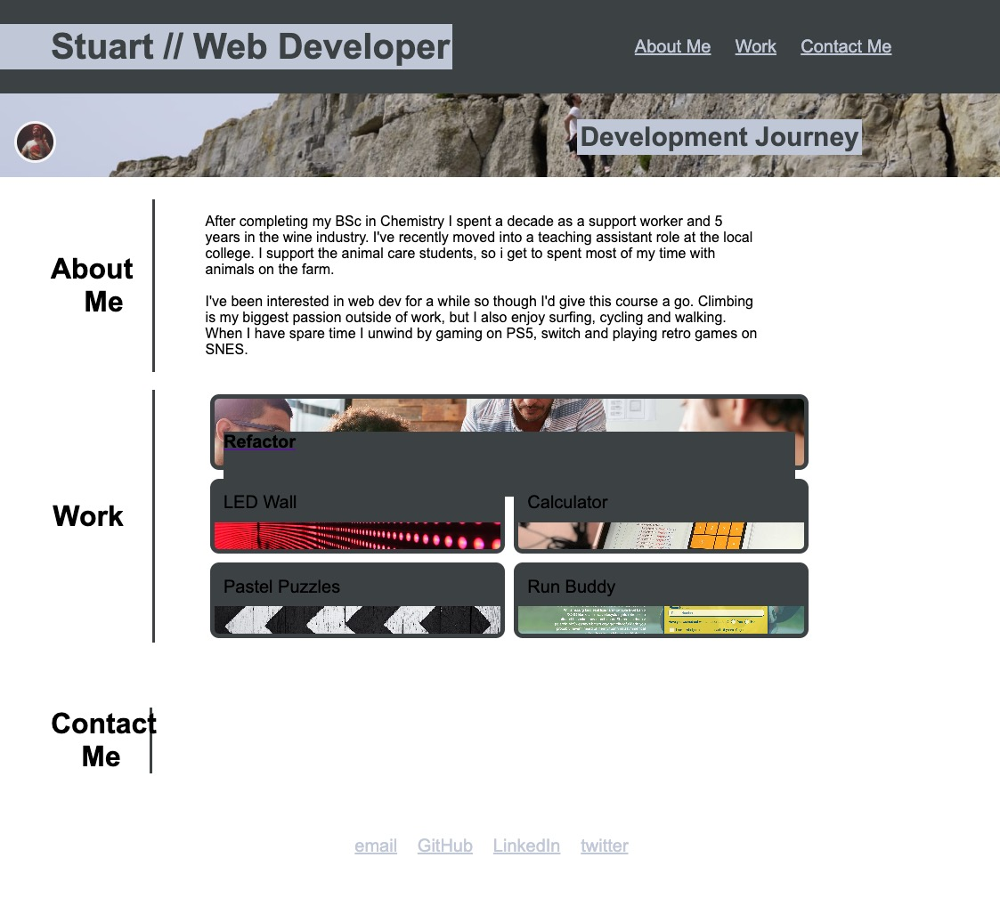

# personal-portfolio

## Description 
§
This site aims to catalogue my progression while learning front end web development. The finished version will be a portfolio to showcase the skills I learn. The format will start out with some basic HTML/CSS structure and formatting, which will be refined as my skills 'develop'.

The project so far has used flex and grid layouts along with some effort to optimize for different screen sizes using @media queries.

My [portfolio](https://stuart540.github.io/personal-portfolio/) was deployed using [GitHub Pages](https://pages.github.com/).

Through the development process so far I have learned some basics of flex and grid boxes, though I certainly encountered several issues along the way. Nested items, particularly links and clickable background images presented the biggest challenges.

## Screenshot

## Link

The site has been deployed using GitHub Pages and can be found [here](https://stuart540.github.io/personal-portfolio/).

## License

Licensed using the standard [MIT](LICENSE) license.

